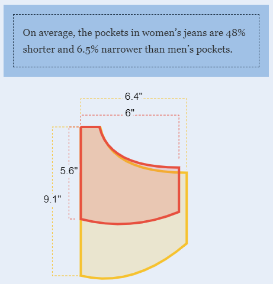

**Cynthia X. Yuen** | `r format(Sys.Date(), '%B %d, %Y')`


```{r setup, include = FALSE}

knitr::opts_chunk$set(echo=F, message=F, warning=F)

library(tidyverse)
library(patchwork)
library(DT)
library(showtext)
library(sjPlot)
library(sjmisc)
library(sjlabelled)
library(gfonts)

# Load Mathematica fonts for figs

font_add_google("Montserrat", "mont")
font_add_google("Zilla Slab", "zilla")
showtext_auto()

# Load Mathematica fonts for body

setup_font(
  id = "zilla-slab",
  output_dir = "www",
  variants = c("regular", "italic", "bold")
)
use_font("zilla-slab", "www/css/zilla-slab.css")

setup_font(
  id = "montserrat",
  output_dir = "www",
  variants = c("regular", "italic", "700")
)
use_font("montserrat", "www/css/montserrat.css")


```


# Introduction
This is a code sample for my application to the position of **Mathematica Junior Data Scientist** (Job ID: 1230-1). As the Director of Research & Data Analysis at the Physician Assistant Education Assocation, I routinely leverage R and R Markdown to analyze and report data of diverse shapes, sizes, and sources. However, I am unable to share my recent professional code because data and methods are proprietary or otherwise protected. Instead, I created new visualizations to highlight an issue that plagues many women: **our pockets are simply too small.**

## Data Source
I borrowed data collected by the brilliant data journalists at [The Pudding](https://pudding.cool), who measured the pockets on men's and women's jeans from 20 brands and [obsessively demonstrated](https://pudding.cool/2018/08/pockets/) that women's pockets are smaller and shallower than men's. Galvanized by their shocking revelations, I wanted to see what other questions I could answer with this dataset.

```{r fig-pudding, out.width="50%", fig.align="center", fig.cap="*Scandalous pocket disparities revealed by The Pudding.*"}


```

## Why Pockets?
Pockets are useful. Period. Yet, so many pockets intended for women are more decorative than functional. I have looked on with jealousy as my husband easily slips a wallet, phone, and keys into his capacious pockets while I struggle to cram a single tube of chapstick into mine. And I'm not the only who thinks so &mdash; the internet is full of [memes](https://static.boredpanda.com/blog/wp-content/uploads/2019/11/1138428432554123264-png__700.jpg), [fashion history](https://medium.com/verve-up/the-bewildering-and-sexist-history-of-womens-pockets-1edf3a98117), and [speculation](https://www.quora.com/Why-does-womens-clothing-often-have-small-or-nonexistent-pockets) about why women are stuck with tiny pockets. Perhaps you, too, have been personally victimized by tiny pockets.


```{r read-data}

# Read pocket area data from The Pudding

pockets <- jsonlite::fromJSON("https://raw.githubusercontent.com/the-pudding/data/master/pockets/measurementRectangles.json") %>% 
  select(brand, menWomen, updatedStyle,
    name, price, pocketArea) %>% 
  arrange(brand, desc(menWomen)) %>% 
  rename(pocket_area_px = pocketArea) %>% 
  mutate(
    id = row_number(),
    pocket_area_cm = pocket_area_px * 0.0264583333, # Original pocket area data are in pixels - this converts to centimeters 
    price_per_cm = price / pocket_area_cm, # Price per square centimeter of pocket
    menWomen = str_to_title(menWomen),
    updatedStyle = str_to_title(updatedStyle)
  )

# Summarize price and size by gender

gender_avg <- pockets %>% group_by(brand, menWomen) %>% 
  summarize(
    avg_area = mean(pocket_area_cm),
    avg_price_per_cm = mean(price_per_cm),
    avg_jeans_price = mean(price))

# Create parity and equity scores amd rankings

brands_parity <- gender_avg %>% 
  pivot_wider(names_from = menWomen, values_from = c(avg_area, avg_price_per_cm, avg_jeans_price)) %>% 
  rename(
    avg_area_m = avg_area_Men,
    avg_area_w = avg_area_Women,
    avg_ppc_m = avg_price_per_cm_Men,
    avg_ppc_w = avg_price_per_cm_Women,
    avg_jeans_price_m = avg_jeans_price_Men,
    avg_jeans_price_w = avg_jeans_price_Women
  ) %>% 
  mutate(
    pocket_size_parity = (avg_area_w / avg_area_m) - 1,
    pocket_price_equity = (avg_ppc_w / avg_ppc_m) - 1
  ) %>% 
  ungroup() %>% 
  # Calculate ranks based on various metrics
  arrange(desc(avg_area_m)) %>% 
  mutate(order_size_m = row_number()) %>% 
  arrange(desc(avg_area_w)) %>% 
  mutate(order_size_w = row_number()) %>% 
  arrange(desc(avg_ppc_m)) %>% 
  mutate(order_ppc_m = row_number()) %>% 
  arrange(desc(avg_ppc_w)) %>% 
  mutate(order_ppc_w = row_number())


# Add parity and equity scores/rankings back to long gender summary df

gender_avg <- gender_avg %>% right_join(brands_parity) %>% 
  select(-matches("_.$"))


```


# Pocket Parity: Size Matters

Across 20 brands, women's pockets were smaller than mens'. Nothing new there. However, I was curious whether this size disparity &mdash; this lack of pocket parity &mdash; differed among brands. To do so, I calculated each brand's average pocket size by gender then created a simple **pocket parity** score: $\frac{\text{Avg. women's pocket size}}{\text{Avg. men's pocket size}}-1$

A score of 0, which (spoiler) no brand achieved, represents a perfectly just world in which men's and women's pockets are the same size, while negative scores reflect the degree to which women's pockets are smaller than men's. 

## "Gap" is Right

In this sample of 20 brands, women's jeans had an average pocket size of `r round(mean(brands_parity$avg_area_w), 1)` sq. cm, whereas men had a generous `r round(mean(brands_parity$avg_area_m), 1)`. That's an overall pocket parity score of `r round(mean(brands_parity$avg_area_w) / mean(brands_parity$avg_area_m) - 1, 2)` sq. cm, meaning that women are losing out on almost half the pocket space that men have. Although all women's pockets were smaller than men's, there was wide variation in pocket parity between brands, with Abercrombie scoring well above average (`r format(round(brands_parity$pocket_size_parity[brands_parity$brand == "Abercrombie"], 2), nsmall = 2)`) and Gap scoring a sad `r format(round(brands_parity$pocket_size_parity[brands_parity$brand == "Gap"], 2), nsmall = 2)`. Among Gap enthusiasts, this translates to `r round(brands_parity$pocket_size_parity[brands_parity$brand == "Gap"] * -100, 0) `% less pocket space for women versus men.


<div align="center">
```{r pocket-parity-plot, fig.showtext=TRUE}

brands_parity %>% 
  ggplot(aes(y = pocket_size_parity, x = reorder(brand, pocket_size_parity))) +
  geom_bar(aes(fill = pocket_size_parity), stat = "identity") +
  coord_flip() +
  geom_text(aes(y = pocket_size_parity - .02, label = format(round(pocket_size_parity, 2), nsmall = 2)),
    size = 3, family = "mont") +
  geom_text(aes(y = -.005, label = brand),
    color = "white", size = 3, family = "mont", hjust = 1, fontface = "bold") +
  scale_y_continuous(limits = c(-.62, .001), expand = c(0, 0), breaks = seq(0, -.6, -.2), labels = format(seq(0, -.6, -.2), nsmall = 2)) +
  labs(y = "Pocket parity") +
  scale_fill_gradient(low = "#f1b51c", high = "#046B5C", name = "Pocket parity") +
  theme_minimal() +
  theme(
    text = element_text(family = "mont"),
    panel.grid = element_blank(),
    plot.margin = margin(r = 7),
    legend.position = "left",
    legend.margin = margin(r = -1.5, unit = "cm"),
    axis.ticks.x = element_line(),
    axis.line.x = element_line(),
    axis.text.x = element_text(size = 10),
    axis.text.y = element_blank(),
    axis.title.y = element_blank(),
    axis.title.x = element_text(size = 12, face = "bold", color = "black", margin = margin(t = 10)),
    legend.text = element_text(size = 10)
  ) +
  plot_annotation(title = "Pocket parity scores") &
  theme(plot.title = element_text(family = "mont", size = 14, face = "bold", hjust = 0))

```
</div>

Plotting the spread in each brand's average pocket size confirms that Abercrombie is leading the group in women's pockets. Gap is middle of the pack in men's pocketing (10th place) but in a dead heat for last place in women's pockets (19th place, but only `r format(round(brands_parity$avg_area_w[brands_parity$brand == "Gap"] - brands_parity$avg_area_w[brands_parity$brand == "Guess"], 2), nsmall = 2)` sq. cm. larger than the tiniest women's pocket, by Guess).

<div align="center">
```{r pocket-discrep-plot, fig.showtext=TRUE}

brands_parity %>% arrange(pocket_size_parity) %>% 
  mutate(brand_ordered = factor(brand, levels = .$brand)) %>% 
  ggplot() +
  geom_segment(
    aes(x = avg_area_w, xend = avg_area_m, 
    y = brand_ordered, yend = brand_ordered, color = pocket_size_parity), size = 1.5) +
  geom_point(data = gender_avg,
    aes(x = avg_area, y = brand, color = pocket_size_parity, shape = menWomen), size = 4) +
  geom_text(data = gender_avg,
    aes(x = ifelse(menWomen == "Women", avg_area - 17, avg_area + 17), y = brand,
        label = round(avg_area, 0)), size = 3, family = "mont") +
  labs(x = "Average pocket size\n(sq. centimeters)", y = "Brand") +
  scale_shape_manual(values = c(15, 19), name = "Gender") +
  scale_colour_gradient(low = "#f1b51c", high = "#046B5C", name = "Pocket parity") +
  guides(shape = guide_legend(override.aes = list(color = "#046B5C"))) +
  theme_minimal() +
  theme(
    text = element_text(family = "mont"),
    panel.grid = element_blank(),
    axis.ticks.x = element_line(),
    axis.line.x = element_line(),
    axis.text.y = element_text(size = 10, color = "black", margin = margin(b = 3)),
    axis.text.x = element_text(color = "black"),
    axis.title.x = element_text(size = 12, face = "bold", color = "black", margin = margin(t = 5)),
    axis.title.y = element_text(size = 12, face = "bold", color = "black", margin = margin(r = 10)),
    legend.text = element_text(size = 10)
  ) +
  plot_annotation(title = "Pocket size discrepancies") &
  theme(plot.title = element_text(family = "mont", size = 14, face = "bold", hjust = 0))

```
</div>

# Are Bigger Pockets Pricier?


There are [numerous theories and histories](https://www.washingtonpost.com/outlook/2020/01/15/why-girls-need-pockets/) about how women's pockets have evolved into the dainty but frequently useless objects of controversy that they are today. One interesting idea is that pockets are expensive to design and make, which may explain why manufacturers are seemingly ignoring women's [fervent demand](https://www.boredpanda.com/women-demand-pockets-memes/?utm_source=google&utm_medium=organic&utm_campaign=organic) to change the status quo. In this sample, men's jeans were indeed slightly more expensive on average (*M* = \$`r round(mean(brands_parity$avg_jeans_price_m), 2)`) than women's (*M* = \$`r round(mean(brands_parity$avg_jeans_price_w), 2)`). Although pants pricing is presumably determined by many complex factors beyond simply pockets, I was interested in exploring whether the price of jeans was related to pocket size.

To investigate this, I ran a linear mixed-effects model to account for random variation due to brand. Interestingly, there was an unexpected trend of higher priced jeans having *smaller* pockets, but this did not approach statistical significance. What was statistically significant though was the effect of gender &mdash; on average, we would expect that women's pockets are almost 127 sq. cm smaller than men's.

<div align="center">
```{r pred-pocket, fig.width = 7}

nlme::lme(pocket_area_cm ~ price + menWomen + updatedStyle,random=~1|brand,data=pockets) %>% 
  tab_model(
    dv.labels = "Pocket size (sq. cm)",
    show.ci = F,
    show.se = T,
    col.order = c("est", "se", "p"),
    pred.labels = c("Intercept", "Price ($)", "Gender: Women", "Fit: Straight"),
    string.est = "Est.",
    string.se = "SE"
  )

```
</div>

Plotting prices against pockets provides visual confirmation that these two attributes aren't meaningfully associated, and highlights the highly significant size discrepancies between genders.


<div align="center">
```{r price-pred-size-fig, fig.showtext=TRUE, results = "hide" }

fit <- lm(pocket_area_cm ~ price + menWomen + updatedStyle, data = pockets)

pockets %>% ggplot(aes(x = price, y = pocket_area_cm, color = menWomen, fill = menWomen)) +
  geom_smooth(method = "lm", formula = str(fit$call),
    show.legend = F, size = 1.5, alpha = .15) +
  geom_point(aes(fill = menWomen, shape = menWomen), size = 3, alpha = .5) + 
  labs(x = "Price ($)", y = "Pocket size (sq. cm)") +
  scale_shape_manual(values = c(15, 19), name = "Gender") +
  scale_colour_manual(values = c("#046B5C", "#0B2949"), guide = F) +
  scale_fill_manual(values = c("#046B5C", "#0B2949"), guide = F) +
  guides(shape = guide_legend(override.aes = list(color = c("#046B5C", "#0B2949"), alpha = 1))) +
  theme_minimal() +
  theme(
    text = element_text(family = "mont"),
    panel.grid = element_blank(),
    axis.ticks = element_line(),
    axis.line = element_line(),
    axis.text.y = element_text(size = 10, color = "black", margin = margin(b = 3)),
    axis.text.x = element_text(color = "black"),
    axis.title.x = element_text(size = 12, face = "bold", color = "black", margin = margin(t = 10)),
    axis.title.y = element_text(size = 12, face = "bold", color = "black", margin = margin(r = 10)),
    legend.text = element_text(size = 10)
  ) +
  plot_annotation(
    title = "Jean prices don't predict pocket size",
    caption = str_glue("Pocket size = {round(coef(fit)[1], 1)} - {-round(coef(fit)[2], 1)}*Price - {round(-coef(fit)[3], 1)}*Women + {round(coef(fit)[4], 1)}*Straight fit")) &
  theme(
    plot.title = element_text(family = "mont", size = 14, face = "bold", hjust = 0),
    plot.caption = element_text(family = "mont", size = 10, face = "italic", color = "#707070", hjust = 0))

```
</div>


<!-- Cutting pocket price equity visualizations, it's a similar story -->


<!-- <div align="center"> -->
<!-- ```{r pocket-price-discrep-plot, fig.showtext=TRUE, fig.width = 8} -->

<!-- brands_parity %>% arrange(desc(pocket_price_equity)) %>%  -->
<!--   mutate(brand_ordered = factor(brand, levels = .$brand)) %>%  -->
<!--   ggplot() + -->
<!--   geom_segment( -->
<!--     aes(x = avg_ppc_w, xend = avg_ppc_m,  -->
<!--     y = brand_ordered, yend = brand_ordered, color = pocket_price_equity), size = 1.25) + -->
<!--   geom_point(data = gender_avg, -->
<!--     aes(x = avg_price_per_cm, y = brand, color = pocket_price_equity, shape = menWomen), size = 3) + -->
<!--   geom_text(data = gender_avg, -->
<!--     aes(x = ifelse(menWomen == "Women" & brand == "Lee", avg_price_per_cm -.07, -->
<!--       ifelse(menWomen == "Men" & brand == "Lee", avg_price_per_cm + .07, -->
<!--         ifelse(menWomen == "Women", avg_price_per_cm +.07, -->
<!--           avg_price_per_cm - .1))), y = brand, -->
<!--         label = format(round(avg_price_per_cm, 2), nsmall = 2)), size = 3, family = "mont") + -->
<!--   labs(x = "Average price ($) per\nsq. cm of pocket", y = "Brand") + -->
<!--   scale_shape_manual(values = c(15, 19), name = "Gender") + -->
<!--   scale_colour_gradient(high = "#f1b51c", low = "#046B5C", name = "Pocket price\nequity") + -->
<!--   guides(shape = guide_legend(override.aes = list(color = "#046B5C"))) + -->
<!--   theme_minimal() + -->
<!--   theme( -->
<!--     text = element_text(family = "mont"), -->
<!--     panel.grid = element_blank(), -->
<!--     axis.ticks.x = element_line(), -->
<!--     axis.line.x = element_line(), -->
<!--     axis.text.y = element_text(size = 10, color = "black", margin = margin(b = 3)), -->
<!--     axis.text.x = element_text(color = "black"), -->
<!--     axis.title.x = element_text(size = 12, face = "bold", color = "black", margin = margin(t = 5)), -->
<!--     axis.title.y = element_text(size = 12, face = "bold", color = "black", margin = margin(r = 10)) -->
<!--   ) + -->
<!--   plot_annotation(title = "The cost of a square inch of pocket") & -->
<!--   theme(plot.title = element_text(family = "mont", size = 14, face = "bold", hjust = 0)) -->

<!-- ``` -->
<!-- </div> -->

# Conclusions

Women's pockets being smaller than men's pockets isn't news to anyone who has ever donned a pair of women's jeans. However, it's surprising to see how large these discrepancies can get across brands, with five brands allotting women less than half the pocket space provided to men. Although some have posited that the continued existence of small-pocketed women's jeans is due to the added expense of making large pockets, there was no evidence of a relationship between price and pocket size in this sample.

Finally, and most importantly: **Bigger pockets for the ladies, please!**

<div align="center">
{width=50%}
</div>


# Check Out the Data{.tabset}

You can explore the datasets I created below. Click the "Download" button to pocket a CSV of each dataset. You can explore The Pudding's original data [here](https://github.com/the-pudding/data/tree/master/pockets).


## Pocket measurements
```{r pocket-measurements}

pockets %>%
  mutate(
    pocket_area_cm = format(round(pocket_area_cm, 1), nsmall = 1),
    price_per_cm = format(round(price_per_cm, 2), nsmall = 2),
    price = format(round(price, 2), nsmall = 2)) %>% 
  select(brand, menWomen, updatedStyle, pocket_area_cm, price, price_per_cm) %>% 
  datatable(
    rownames = F,
    colnames = c("Brand", "Men's or women's", "Style", "Pocket size (cm)", "Price ($)", "Price per cm ($)"),
    extensions = "Buttons",
    options = list(dom = "Bflrtip", 
      buttons = list(list(extend = "csv",
        text = "Download")),
      lengthMenu = list(
        c(10, 25, 50, 80),
        c(10, 25, 50, "All")),
        columnDefs = list(list(className = "dt-right", targets = 3:5))
      ))

```

## Brand summaries

```{r brand-parity}

brands_parity %>% 
  select(
    brand,
    pocket_size_parity,
    contains("avg_area"),
    contains("avg_ppc")) %>%
datatable(
  rownames = F,
  colnames = c("Brand", "Pocket parity", "Avg. pocket (Men)", "Avg. pocket (Women)", "Avg. $ per cm (Men)", "Avg. $ per cm (Women)"),
  extensions = "Buttons",
  options = list(dom = "Bflrtip", 
    buttons = list(list(extend = "csv",
      text = "Download")),
    lengthMenu = list(
      seq(10, 20, 10),
      c(10, "All")),
      columnDefs = list(list(className = "dt-right", targets = 3:5))
    )) %>% 
  formatRound(columns = 2:6, digits = 2)

```